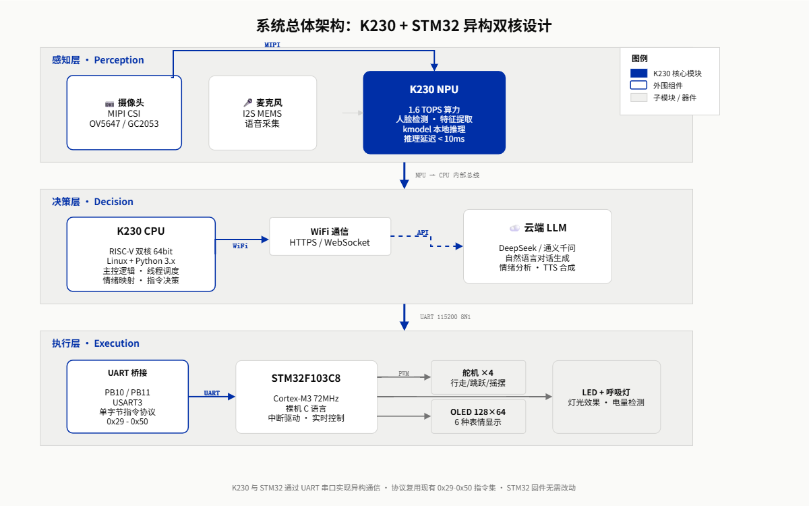

# 开题报告 PPT 配图需求说明

## 总览

| 编号 | 出现页 | 比例 | 类型 | 文件名建议 |
|------|--------|------|------|-----------|
| 配图1 | P4 系统总体架构 | 16∶10 | 信息图/框图 | `04-architecture.png` |
| 配图2 | P5 硬件平台 | 21∶9 | 实物照片 | `05-k230-board.jpg` |
| 配图3 | P6 硬件模块 | 16∶9 | 实物照片 | `06-stm32-dog.jpg` |
| 配图4 | P6 硬件模块 | 16∶9 | 实物照片 | `06-camera-module.jpg` |
| 配图5 | P6 硬件模块 | 16∶9 | 实物照片 | `06-voice-module.jpg` |
| 配图6 (可选) | P4 架构页或 P7 功能页 | 16∶9 | 示意图 | `07-feature-demo.jpg` |

---

## 配图1 · 系统总体架构框图

- **用于**: 第 4 页「三层异构架构设计」
- **比例**: 16∶10（横版宽图）
- **类型**: 信息图 / 框图（可用 PPT / draw.io / Figma 绘制）
- **内容要求**:
  - 从上到下三层: 感知层 → 决策层 → 执行层
  - 感知层: 摄像头 + 麦克风 → K230 NPU
  - 决策层: K230 CPU + WiFi 云端 LLM
  - 执行层: UART → STM32 → 舵机/OLED/LED
  - 层间用箭头连接，标注通信协议（MIPI / UART / WiFi）
- **风格**: 简洁线框图，白底或浅灰底，蓝色作为强调色
- **搜索/制作关键词**: system architecture diagram, three-layer embedded system, edge AI architecture, 嵌入式系统架构图
- **参考搜索**: 「边缘AI系统架构」「异构双核嵌入式架构图」

---

## 配图2 · K230 庐山派开发板

- **用于**: 第 5 页「硬件平台」
- **比例**: 21∶9（宽横幅图，适合 S22 Image Hero 版式）
- **类型**: 实物照片
- **内容要求**:
  - K230 庐山派开发板正面，平放在浅色背景上
  - 摄像头模块已连接（MIPI CSI 排线可见）
  - 拍摄角度: 从上方略微倾斜，展示接口
  - 清晰度 ≥ 1600px 宽，背景干净
- **搜索关键词**: CanMV K230 庐山派 开发板 实物
- **提示**: 可以自己拍，放在白纸上自然光拍摄即可

---

## 配图3 · STM32 电子小狗

- **用于**: 第 6 页「三大核心硬件模块」
- **比例**: 16∶9
- **类型**: 实物照片
- **内容要求**:
  - 组装好的 STM32 小狗正面/侧面，展示 OLED 表情屏和舵机腿
  - 外壳（3D 打印件）完整可见
  - 背景干净，光线充足
- **搜索关键词**: 你自己的硬件，直接拍摄
- **提示**: 放在桌面自然光拍摄，让 OLED 显示一种表情

---

## 配图4 · MIPI 摄像头模组

- **用于**: 第 6 页「三大核心硬件模块」
- **比例**: 16∶9
- **类型**: 实物特写照片
- **内容要求**:
  - MIPI CSI 摄像头模组特写（如 OV5647 或 GC2053）
  - 展示排线接口
- **搜索关键词**: MIPI CSI camera module, OV5647, GC2053, 摄像头模组
- **提示**: 可以直接拍你自己的摄像头模块

---

## 配图5 · 语音交互模块

- **用于**: 第 6 页「三大核心硬件模块」
- **比例**: 16∶9
- **类型**: 实物照片 / 连接示意图
- **内容要求**:
  - 可以是 I2S 麦克风模组 + 扬声器的实物照片
  - 或者是 K230 连接麦克风的接线示意图
- **搜索关键词**: I2S microphone module, MEMS 麦克风模组
- **提示**: 可以直接拍你自己的麦克风和扬声器模块

---

## 配图6 (可选) · 人脸识别效果示意

- **用于**: 可选，放在 P7 功能页或 P4 架构页
- **比例**: 16∶9
- **类型**: 效果示意图 / 概念图
- **内容要求**:
  - 展示摄像头画面中人脸检测框的效果
  - 或者通过图文说明"熟人→欢迎"/"陌生人→告警"的流程
- **搜索关键词**: face detection demo, 人脸检测效果图, AI camera recognition concept
- **提示**: 这个是可选配图，如果找不到合适的可以不放

---

## 文件放置

所有配图放到 `E:\STM32\desktop-watchdog\ppt\images\` 目录下。

替换方法：找到 `index.html` 中对应的 `🖼 配图N` 占位块，将 `<div class="frame-img ...">` 内的占位 HTML 替换为:

```html

```

---

## 规格建议

- 单张宽度 ≥ 1600px（避免大屏投影模糊）
- JPG 用于实物照片，PNG 用于信息图/框图
- 总大小控制在 10MB 内（保证翻页流畅）
- 同组图片（配图3-5）统一 16∶9，不要混用比例
